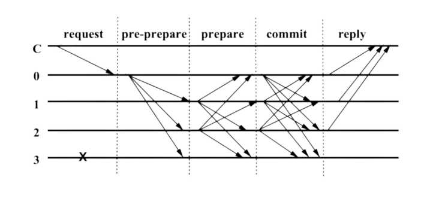
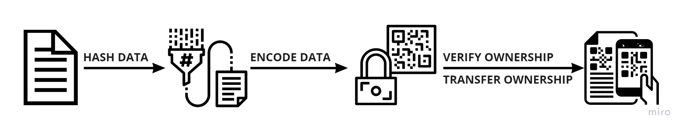

# 📃 Whitepaper.V1

LifeDeFied \
DeFing a New Future\
**04 | 15 | 22**
----------------

## **Table of Contents**

**Glossary of Terms**

**1 -  Introduction**                                                        \
**History** \
**Purpose**&#x20;

**2 - Tendermint Overview** \
**Introduction** \
**ABCI** \
**Consensus** \
**Light Client** \
**Peer Discovery (P2P)**&#x20;

**3 - Inter Blockchain Communication** \
**Introduction** \
**IBC- TAO Layer** \
I**BC- APP Layer**&#x20;

**4 - BigchainDB Overview**\
**Introduction**\
**B-DB Node** \
**B-DB Network** \
**B-DB Consortium**&#x20;

**5 - Chainlink Overview** \
**Introduction** \
**Hybrid Smart Contracts** \
**OracleTree Application** \
**dNFT Dynamic Non-Fungible Token**&#x20;

**6 - HomeTree Overview** \
**Introduction** \
**Global Network** \
**HEXTree (Hybrid Exchange)** \
**LiquidityTree (Hybrid Liquidity Pool)**&#x20;

**7 - ChainBranch Overview** \
**Introduction** \
**Public Layer** \
**Private Layer** \
**ChainBranch WMS**&#x20;

**8 - BranchApps Overview** \
**Introduction** \
**BranchApp Types**\
**ChainBranches** \
**Asset Tokenization** \
**Blockchain QR Codes** \
**NFC (Near Field Communication)** \
**Lending & Borrowing** \
**Insurance Staking Pool** \
**Cold Storage Staking** \
**Decentralized Identities** \
**BranchMarket**&#x20;

**9 - LifeDeFied Utility Coin Overview**\
**Introduction** \
**Staking Model** \
**Private ICO** \
**Private ICO Info** \
**Public Fundraiser ICO**&#x20;

**10 - LifeDeFied Utility Token Overview** \
**Introduction** \
**Staking Model** \
**Public to Private Staking**&#x20;

**11 - Security Model Overview** \
**Introduction** \
**Open Transparency** \
**Bounty Program** \
**Inter to Outer Chain Security**&#x20;

**12 -  Company Socials | Acknowledgments | Citations**&#x20;

## **Glossary of Terms**

****

| **Term**                                                                            | **Definition**                                                                                                                                                                                                                                                                                                                                                                                                         |
| ----------------------------------------------------------------------------------- | ---------------------------------------------------------------------------------------------------------------------------------------------------------------------------------------------------------------------------------------------------------------------------------------------------------------------------------------------------------------------------------------------------------------------- |
| 
<strong>ABCI</strong> <strong>(Application Blockchain Interface)</strong>
 | **ABCI stands for "Application Blockchain Interface". ABCI is the interface between Tendermint (a state-machine replication engine) and your application (the actual state machine)**                                                                                                                                                                                                                                  |
| **BFT (Byzantine Fault Tolerance)**                                                 | **The property of a system that can resist the class of failures derived from the Byzantine Generals' Problem. This means that a BFT system can continue operating even if some of the nodes fail or act maliciously**                                                                                                                                                                                                 |
| **Brancher**                                                                        | **A dedicated HomeTree Application for connecting to other blockchain networks that reside outside of the LifeDeFied platfor m (Ethereum, cosmos, Polkadot, avalanche (etc))**                                                                                                                                                                                                                                         |
| **BranchApps**                                                                      | **LifeDeFied terminology for a decentralized application (dApp) that runs in parallel with the core HomeTree blockchains and ChainBranches**                                                                                                                                                                                                                                                                           |
| **BranchMarket**                                                                    | **The BranchMarket is a DeFi marketplace for listing, exchanging, selling, buying or advertising tokenized LDUT assets. It also contains all the BranchApplications that can be accessed by the user or their consortium as well as 3rd parties that extend outside of the public network.**                                                                                                                           |
| **Bonding**                                                                         | **The process of staking assets together**                                                                                                                                                                                                                                                                                                                                                                             |
| **LW3S**                                                                            | 
<strong>Sub name and The acronym used to represent</strong>  <strong>LifeDeFied Web3 Services</strong>
                                                                                                                                                                                                                                                                                                       |
| **LDUC**                                                                            | **LifeDeFied Utility Coin that powers the interoperability between networks of HomeTrees, Chainbranches, BranchApplications and other Blockchains**                                                                                                                                                                                                                                                                    |
| **LDUT**                                                                            | **LifeDeFied Utility Token that powers the stable dynamic NFT asset tokenization and decentralized applications (dApps) on the public layer of the BranchMarket**                                                                                                                                                                                                                                                      |
| **LDLT**                                                                            | **LifeDeFied Liquidity Token Reward for Liquidity Providers (LP) pooling their assets together to aid in the exchange process of the HEXTree.**                                                                                                                                                                                                                                                                        |
| **CBDC (Central Bank Digital Currency)**                                            | **A central bank's digital currency is the digital form of a country's fiat currency. A CBDC is issued and regulated by a nation's monetary authority or central bank**                                                                                                                                                                                                                                                |
| 
<strong>CeFi</strong> <strong>(Centralized Finance)</strong>
              | **CeFi, short for centralized finance, offers some of the yield benefits of DeFi with some of the ease of use and security of traditional financial-services products**                                                                                                                                                                                                                                                |
| 
<strong>CEX</strong> <strong>(Centralized Exchange)</strong>
              | **Centralized Exchanges (CEX) are a type of cryptocurrency exchange which requires the need of an intermediary third party for transactions to take place. Usually in the case of FIAT.**                                                                                                                                                                                                                              |
| **ChainBranches**                                                                   | **ChainBranches are the users or consortium's blockchains that operate both on a public and private layer**                                                                                                                                                                                                                                                                                                            |
| **Cold Storage Wallet**                                                             | **A cold wallet, otherwise known as a hardware wallet or cold storage, is a physical device that keeps your cryptocurrency completely offline. Many look like USB drives. Taking your holdings offline helps protect you from hacking and online attacks**                                                                                                                                                             |
| **Cold Storage Staking**                                                            | **Cold staking involves the freezing of crypto funds in offline wallets. This makes it far more secure, as your funds will be entirely protected from cybercriminals. Additionally, cold staking is more environmentally friendly than online staking. This is, again, because of the storage methods used**                                                                                                           |
| **Consortium**                                                                      | **A consortium is a group of user ChainBranches that can operate both on a public or private layer based on the governance model**                                                                                                                                                                                                                                                                                     |
| **Delegator**                                                                       | **A delegator is someone who wishes to not become a full validator and instead delegates their coins/tokens to a full validator or staking pool to partake in the overall consensus and receive additional LDUC**                                                                                                                                                                                                      |
| 
<strong>dApp</strong> <strong>(Decentralized Application)</strong>
        | **A decentralized application is an application that can operate autonomously, typically through the use of smart contracts, that runs on a decentralized computing blockchain system. Like traditional applications, dApps provide some function or utility to their users**                                                                                                                                          |
| 
<strong>DeFi</strong> <strong>(Decentralized Finance)</strong>
            | **Decentralized finance (DeFi) is an emerging financial technology based on secure distributed ledgers similar to those used by cryptocurrencies**                                                                                                                                                                                                                                                                     |
| 
<strong>DEX</strong> <strong>(Decentralized Exchange)</strong>
            | **Decentralized exchanges (DEX) are a type of cryptocurrency exchange which allows for direct peer-to-peer cryptocurrency transactions to take place online securely and without the need for an intermediary**                                                                                                                                                                                                        |
| 
<strong>dNFT</strong> <strong>(Dynamic Non-Fungible Token)</strong>
       | **A dynamic NFT is an NFT that can change based on external conditions. Change in a dynamic NFT often refers to changes in the NFT's metadata triggered by a smart contract**                                                                                                                                                                                                                                          |
| 
<strong>DON</strong> <strong>(Decentralized Oracle Network</strong>
       | **Decentralized oracle networks (DONs) enable the creation of hybrid smart contracts, where on-chain code and off-chain infrastructure are combined to support advanced decentralized applications (dApps) that react to real-world events and interoperate with traditional systems**                                                                                                                                 |
| **Hashed**                                                                          | **A cryptographic hash function is a mathematical algorithm that maps data of arbitrary size to a bit array of a fixed size. It is a one-way function, that is, a function for which it is practically infeasible to invert or reverse the computation**                                                                                                                                                               |
| **Hardware Wallet**                                                                 | **Hardware wallets are a form of offline storage. A hardware wallet is a cryptocurrency wallet that stores the user's private keys (a critical piece of information used to authorize outgoing transactions on the blockchain network) in a secure hardware device**                                                                                                                                                   |
| 
<strong>HEX</strong> <strong>(Hybrid Exchange)</strong>
                   | **A hybrid crypto exchange (HEX) provides users with access to their private keys and aims to solve the scalability issues of decentralized exchanges**                                                                                                                                                                                                                                                                |
| **HEXTree**                                                                         | **A Hybrid Distributed exchange that's interconnected to the HomeTree. The HEXTree provides fast distribution custody of funds for both fiat and crypto users**                                                                                                                                                                                                                                                        |
| **HomeTree**                                                                        | **The HomeTree is the public layer of the LifeDeFid blockchain network. Each HomeTree acts as a “root” custodian facilitating the movement of coins/tokens within the network of other HomeTrees.**                                                                                                                                                                                                                    |
| **Hot Wallet**                                                                      | **A hot wallet can also be called a software wallet. It's a form of digital storage that you can access on your computer or phone and is connected to the internet. Because of the internet connection, hot wallets are not as secure as a cold wallets**                                                                                                                                                              |
| 
<strong>ICO</strong> <strong>(Initial Coin Offering)</strong>
             | **An initial coin offering (ICO) is the cryptocurrency industry's equivalent to an initial public offering (IPO)**                                                                                                                                                                                                                                                                                                     |
| 
<strong>IBC</strong> <strong>(Inter Blockchain Communication)</strong>
    | **The Inter‐Blockchain Communication Protocol (IBC), an open‐source protocol for relaying messages between independently distributed ledgers**                                                                                                                                                                                                                                                                         |
| **Interoperability**                                                                | **The ability of different blockchain networks to exchange and leverage data between one another and to move unique types of digital assets between the networks' respective blockchains**                                                                                                                                                                                                                             |
| 
<strong>KYC</strong> <strong>(Know Your Customer)</strong>
                | **KYC means "know your customer." It refers to a financial institution’s obligation to carry out certain identity and background checks on its clients before allowing them to use its product or platform**                                                                                                                                                                                                           |
| 
<strong>KYT</strong> <strong>(Know Your Transaction)</strong>
             | **Know-your-transaction is a process that gathers information on transactions made by a financial business. It assesses whether the transactions are legal and not linked to financial crimes. With KYT, financial institutions can gather information and assess the risk of the transactions executed by their customers**                                                                                           |
| **Tendermint Core**                                                                 | **Tendermint Core is a blockchain application platform; it provides the equivalent of a web server, database, and supporting libraries for blockchain applications written in any programming language. Like a web-server serving web applications, Tendermint serves blockchain applications**                                                                                                                        |
| 
<strong>TradFi</strong> <strong>(Traditional Finance)</strong>
            | **TradFi consists of retail, commercial, and investment banks, and FinTechs (tech companies that operate in finance). For example, Goldman Sachs and JPMorgan Chase as banks, and SoFi, Square, and PayPal as FinTech companies**                                                                                                                                                                                      |
| **Tokenization**                                                                    | **Tokenization is the process where assets are converted into a token that can then be moved, stored, and recorded on the blockchain**                                                                                                                                                                                                                                                                                 |
| 
<strong>LP</strong> <strong>(Liquidity Provider)</strong>
                 | **A liquidity provider is a user who funds a liquidity pool with crypto assets they own to facilitate trading on the platform's exchange and earn a passive yield for helping to facilitate that process**                                                                                                                                                                                                             |
| **Liquidity Pool**                                                                  | **A liquidity pool is a vault into which participants deposit their assets in order to form a market (trading pair) and make it liquid for those wishing to trade in that pair. Technically speaking, the vault is a smart contract that enables users to securely store their tokens.**                                                                                                                               |
| **LiquidityTree**                                                                   | **A LiquidityTree is a term that refers to a “hybrid” liquidity pool model that helps HEXTree facilitate its buyers and sellers (traders) between CBDCs and other cryptocurrencies**                                                                                                                                                                                                                                   |
| 
<strong>NFC</strong> <strong>(Near Field Communication)</strong>
          | **Near Field Communication allows for contactless payment between devices. Most commonly found in today's smartphones/devices which can now support crypto-based payments**                                                                                                                                                                                                                                            |
| 
<strong>NFT</strong> <strong>(Non-Fungible Token)</strong>
                | **A non-fungible token is a financial security consisting of digital data stored in a blockchain, a form of a distributed ledger. The ownership of an NFT is recorded in the blockchain and can be transferred by the owner, allowing NFTs to be sold and traded**                                                                                                                                                     |
| **Node**                                                                            | **Nodes form the infrastructure of a blockchain. All nodes on a blockchain are connected and they constantly exchange the latest blockchain data with each other so all nodes stay up to date. They store, spread, and preserve the blockchain data, so theoretically a blockchain exists on nodes. A full node is a device (like a computer) that contains a full copy of the transaction history of the blockchain** |
| **OracleTree**                                                                      | **The OracleTree is a term for a dedicated Chainlink DON integration that's connected to the HomeTree to update off-chain events on-chain to its corresponding ChainBranches and their dynamic tokenized smart contracts**                                                                                                                                                                                             |
| 
<strong>Private ICO</strong> <strong>(Initial Coin Offering)</strong>
     | **A private ICO is for a pre-selected group of investors, partners, contributors and advisors to acquire LDUC at a discounted rate to test certain functionality of the LifeDeFied platform before its ICO**                                                                                                                                                                                                           |
| **Smart Contract**                                                                  | **A smart contract is a computer program or a transaction protocol that is intended to automatically execute, control, or document legally relevant events and actions according to its terms.**                                                                                                                                                                                                                       |
| **Staking**                                                                         | **offers crypto holders a way of putting their digital assets to work and earning passive income without needing to sell them. You can think of staking as the crypto equivalent of putting money in a high-yield savings account**                                                                                                                                                                                    |
| **Validator**                                                                       | **A validator runs a full node and is selected based on the overall amount of staked LDUC. Each validator is responsible for participating and securing the overall consensus of the LifeDeFied Platform , its HomeTrees, and ChainBranches which include the user or their consortium**                                                                                                                               |
| **Web2**                                                                            | **Web2 refers to websites that emphasize user-generated content, ease of use, participatory culture, and interoperability for end users**                                                                                                                                                                                                                                                                              |
| **Web3**                                                                            | **Web3 is an idea for a new iteration of the World Wide Web-based on blockchain technology, which incorporates concepts such as decentralization and token-based economics**                                                                                                                                                                                                                                           |
| **WMS**                                                                             | **Wallet management system is a program designed to facilitate the management of multiple virtual currency wallets from a single interface. Institutional or retail crypto investors can use it.**                                                                                                                                                                                                                     |

## **1 - Introduction**

### **History**

**Decentralized ecosystems have evolved and come a long way since the first release of Satoshi's Whitepaper that introduced us to Bitcoin back in 2008. Over a decade later, we have since then witnessed the birth of a new internet that is no longer centralized and is transitioning each day to a more decentralized form of exchanging, storing, and securing our information and assets on a global scale.**

**Through innovation, we have witnessed the rise of Ethereum which introduced us to decentralized applications in the form of Smart Contracts and the application of Non Fungible Tokens (NFTs).**

**Then came several other blockchain platforms that included the Cosmos Network, which introduced us to the capability of being able to scale, customize and have interoperability between multiple blockchains while still being able to achieve sovereignty.**

**What once used to be a separated ecosystem of independent blockchains and platforms, is now being interconnected on a global scale through the use of crosschain technology. Some examples of such technology include the IBC protocol (inter-blockchain communication) and Chainlink, which provides the capability of bringing off-chain data on-chain through its DON (decentralized oracle network).**

**As of today, however, the services and solutions these platforms aim to provide have certain drawbacks with real-world use cases the common web2 and web3 users look for in having access to an all-in-one decentralized platform.**

**This platform, for example, would allow the user or their consortium to have the capability of tokenizing their physical or digital assets and safeguarding them on their blockchain ledgers while still being able to interoperate in a new world that revolves around a Government Central Bank Digital Currency (CBDC).**

**Most current blockchain platforms or networks require a technical background or understanding that limits most web2 users and companies from adopting or starting the process of understanding its real-world application. Additionally, web3 users or companies already involved in this space will find themselves owning different forms of tokens and cryptocurrencies on multiple blockchain platforms with little to no real-world usability.**

**This is due to a lack of innovation or a repeating cycle of developing pre-existing projects. Some of these real-world use cases are yet to be developed by a platform.**

### **Purpose**

**The 1st version of this whitepaper is to introduce you to LifeDeFied. An all-in-one innovative DeFi blockchain platform aiming to innovate, solve and develop multiple real-world apps through its decentralized applications to branch the financial gaps between Traditional Finance (TradFi), Centralized Finance (CeFi), and Decentralized Finance (DeFi)**

**The public blockchain network (HomeTree) is powered by Ignites Tendermint Core which in turn, empowers the user or consortium leveled communities, to further branch off into their own private blockchain networks (ChainBranch) that act as distributed ledgers.**

**These ChainBranch ledgers can operate both on a public and private layer (permissionless to permission-based) and can be further integrated with multiple decentralized solutions (BranchApps), which are in the form of a sidechain (crosschain) interoperable decentralized application.**&#x20;

**Using cross-chain technology and the interoperability between distributed ledgers, we’re able to provide the user or the consortium ChainBranches access to a global DeFi BranchMarket where they sync (sign) to create or connect to a new desktop/mobile web3 seed identity**

**This all-in-one DeFi BranchMarket (marketplace) hosts the distributed BranchApplications (dApps) that are accessible through the public layer allowing the capability for 3rd parties that extend outside of the LifeDeFied blockchain platform to also engage with the global network.**

**The 1st KEY BranchApp you will find in the BranchMarket allows the user or the consortium to branch off into their blockchain ledgers, which initiates the 2nd KEY BranchApp of being able to tokenize multiple forms of physical or digital assets directly through the LifeDeFied mobile or desktop BranchApp (dApp).**

**Once the assets are tokenized, they’re assigned a unique hash value along with its corresponding smart contract and further stored on the users or consortium's blockchain ledger. From here they’ll access other KEY BranchApps and services designed for real-world applications that are meant for both the web2 and web3 user.**

**Additionally having the ability to interoperate with other users or consortium blockchain ledgers operating within or outside of the LifeDeFied platform. This supports the use case of being able to exchange tokenized assets or information between centralized exchanges (CEX) or ledgers (i.e) Coinbase and Commercial Banks that revolve around a Central Bank Digital Currency (CBDC).**

**Our team is proud to be one of the first DeFi PIONEERS in being able to innovate, solve and develop multiple LifeDeFied Web3 Services (LD3S) that can be accessed through the public blockchain layer of the platforms BranchMarket.**

**Consumers, businesses and governments will have the capability in being able to tokenize various assets where they can then further manage them on their blockchain ledgers and be able to access a global DeFi marketplace full of decentralized applications**

**This is the next KEY innovative project for a decentralized non custodial platform to provide its users full custody access to new layer of economic freedom, securities, services and stabilization through tokenization.**

\
**Keaton McCune (k3ytoshi)**

## **2 - Tendermint Overview**

### **Introduction**

**(Rebranded to Ignite) Tendermint is open-source software for securely and consistently replicating an application on many machines. It works even if up to 1/3 of machines fail in arbitrary ways. Every non-faulty machine sees the same transaction log and computes the same state. Secure and consistent replication is a fundamental problem in distributed systems; it plays a critical role in the fault tolerance of a broad range of applications whether that be on an individual, commercial, organizational or enterprise level.**

**The ability to tolerate machines failing in arbitrary ways, including becoming malicious, is known as Byzantine fault tolerance (BFT). The theory of BFT is decades old, but software implementations have only become popular recently, due largely to the success of "blockchain technology" like Bitcoin and Ethereum. Blockchain technology is just a re-formalization of BFT in a more modern setting, with emphasis on peer-to-peer networking and cryptographic authentication. The name derives from the way transactions are batched in blocks, where each block contains a cryptographic hash of the previous one, forming a chain. In practice, the blockchain data structure optimizes BFT design.**

### **ABCI**

**ABCI stands for Application Blockchain Interface. ABCI is the interface between Tendermint (a state-machine replication engine) and the application (the actual state machine). It consists of a set of **_**methods**_**, each with a corresponding Request and Response Message type. To perform state-machine replication, Tendermint calls the ABCI methods on the ABCI application by sending the Request\* messages and receiving the Response\* messages in return.**

 (1).jpg>)

\
**ABCI is unique in the sense that it allows our development team to develop and test multiple decentralized BranchApplications in different forms of programming languages that can further run in parallel with the HomeTree Blockchains and their corresponding ChainBranch Blockchains.** \
****

### **Consensus**

**The consensus is an asynchronous BFT (Byzantine Fault Tolerance) protocol that follows the architecture of a simple state machine.**

**Participants in the protocol are called validators; they take turns proposing blocks of transactions and voting on them. Blocks are committed in a chain, with one block at each height. A block may fail to be committed, in which case the protocol moves to the next round, and a new validator gets to propose a block for that height. Two stages of voting are required to successfully commit a block; call them pre-vote and pre-commit. A block is committed when more than 2/3 of validators pre-commit for the same block in the same round.**\
**Tendermint refers to this as a Polka (hence the dancers)**

**Validators may fail to commit a block for a couple of reasons. The proposer may be offline, or the network may be slow. Tendermint however allows the faulty validator to be skipped. Validators wait a small amount of time to receive a complete proposal block from the proposer before voting to move to the next round. This reliance on a timeout is what makes Tendermint a weakly synchronous protocol, rather than an asynchronous one. However, the rest of the protocol is asynchronous, and validators only make progress after hearing from more than two-thirds of the validator set. A simplifying element of Tendermint is that it uses the same mechanism to commit a block as it does to skip to the next round.**

**Assuming less than one-third of the validators are Byzantine, Tendermint guarantees that safety will never be violated - that is, validators will never commit conflicting blocks at the same height. To do this it introduces a few locking rules which modulate which paths can be followed in the flow diagram. Once a validator pre-commits a block, it is locked on that block. Then,**

1. **It must prevote for the block it is locked on**
2. **It can only unlock, and pre-commit for a new block, if there is a polka for that block in a later round**

### **Light Clients**

**A light client is a lightweight alternative to a full running node. Full nodes are often more resource-heavy because they are executing and synchronizing multiple states of transactions. A light client has lower resource requirements since they only verify the results without the execution of the transaction states, due to this full nodes synchronize more data while a light client only synchronizes with the recent headers.**

**Each light client is decomposed into 2 main components**

1. **Commit Verification which verifies the signed headers and associated validators set from the full node.**
2. **Attack detection which verifies commits across multiple full nodes and detects conflicts that can be in the form of a DoS (denial of service) If there is such an event where the light client attack is detected, the light client will end up submitting evidence to the full node that is responsible for “punishing” attackers which are the validators of that given full node.**

### **Peer Discovery (P2P)**

**A Tendermint P2P network has different types of nodes that each have their unique requirements for interconnectivity between one another.**\
****\
**The 1st node is known as a (Seed) which is the first point of contact for each new node. Each seed is responsible for returning a list of known active peers and will then disconnect once it's finished. They should operate full nodes and be in “crawler” mode meaning they are actively scanning the network to validate the availability of peers (nodes).**

**The 2nd node is known as a (New Full Node). This type of New Node requires a list of seeds that can be provided to tender mint via its config file or coded into the software based on the application. It also requires a ChainID which is also called the “Network” on the P2P layer. From there it requires the recent block height and a hash of the blockchain.**

**With the above listed, the node will then query its seeds to discover peers and begin to run the Tendermint protocol with the ones it successfully connects to. When the peer nodes catch up to the current block height, it double checks that the hashes match. If the hashes fail to match, Tendermint will exit and the user will need to try again. This can be a result of a bad connection or validation between the consensus of its peers.**

**The 3rd node is known as a (Restarted Full Node) and is used when a node checks its address book on startup when trying to connect to its peers. If it for some reason fails to connect to any of the peers after a given time, it falls back to the initial seed of peers. They can run full nodes to sync up to the latest state of the blockchain from its most recent committed block.**

**The 4th node is known as (Validator Node) and is used with a validator signing KEY. Due to them handling the signing of the validators KEY, this node requires an additional layer of security by making sure it can receive incoming connections. It should only be responsible for the outgoing connection to a controlled set of “Sentry Nodes” that act as a proxy shield**

**The 5th node is known as a (Sentry Node) and is considered to be the guardian of the validator node in providing access to the rest of the network. Every sentry node should be well connected to the full nodes and may remain dynamic but should maintain a random connection with other Sentry Nodes. It should always be anticipating incoming connections from the validator node and its corresponding backup(s). They never gather or log the validators node address and limit the quality of connected peers.**

## **3 - Inter Blockchain Communication**

### **Introduction**

**IBC (inter blockchain communication) is an interoperability protocol for communicating arbitrary data between arbitrary state machines (applications)**

**The protocol itself consists of two distinct layers**\
**1. Transport, authentication, and ordering layer (IBC/TAO)**\
**2. Application (state machines) layer built on top of TAO (IBC/APP)**

**The transport layer provides the necessary infrastructure to establish secure connections to authenticate data packets between chains**

**The application layer defines exactly how the data packets should be packed and interpreted by the sending and receiving chains.**

**Once the TAO layer is implemented on a ledger, different APP layer protocols can be integrated on top of it.**\
**This APP layer can be used to build and deploy a variety of DeFi cross-chain applications**

**Including but not limited to**

**- LiquidityTrees**\
**- HEXTree Exchange**\
**- Asset Tokenization**\
**- Chainlink OracleTree**\
**- Lending & Borrowing**\
**- Trading & Exchanges**\
**- Decentralized Identities**\
**- Global DeFi Marketplace**\
**- Individual Blockchain Ledgers**\
**- Interest on loaned assets**\
**- Security & Insurance of Assets**\
**- Community Staking**\
**- Online and Offline Storage**\
**- Physical and Digital NFTs**

### **IBC - TAO LAYER**

**The TAO layer is meant for relaying packets between two blockchains in a RELIABLE **_**-**_** AUTHENTICATED - ORDER**

**RELIABLE means that the packet sent by the original blockchain source is received by the destination chain exactly once. The key feature here is there is not a centralized 3rd party exchanging the information. A permissionless relayer is in charge of that process**

**AUTHENTICATED means that IBC uses a channel for relaying packets that are assigned to its module or in this case a specific smart contract. This helps provide an extra layer of security by ensuring the packet being received on the destination chain was sent by the original blockchains smart contract. This prevents other smart contracts that reside out of the channel from interfering with the protocol.**

**ORDER means that the destination chain receiving the packets is still in the same order as when it was sent by the original blockchain.**

### **IBC - APP LAYER**

**The APP layer is integrated on top of the IBC/TAO layer which enables arbitrary crosschain protocols which can be their applications.**\
**These protocols can include a variety of services and features that can be grouped on the TAO module and plugged into the application layer of Tendermint.**

 .jpg>)

## **4 - Nodes, Networks & Consortiums**&#x20;

### **Introduction**

**is an open-sourced scalable decentralized database that's prepackaged with Tendermint and MongoDB already configured. We can bootstrap this open-source library further and customize an SDK application with the inter-blockchain communication (IBC) protocol fully integrated.**

**This can then further allow the platform to provide the user or the consortium the capability of being able to quickly branch off into their ChainsBranches but still achieve interoperability within the LifeDeFied Platform , its HomeTrees, BranchApplications, and other blockchains that even reside out of the network.**

\
**We see this being an effective open-source tool in being able to empower the people on a global scale with blockchain ledgers and begin the tokenization process**

### **LD-Node(s)**

**A node is a machine or what's also known as a logical machine running on a server. Each node can either be hosted or controlled by the end user . Meaning you’re able to have more than one (node) involved within the specific blockchain network.**\

### **LD-Network(s)**

**A set of nodes that are connected arrange what's called a network. Each node within the network is powered by Ignites Tendermint Core. By having multiple nodes within the network you can dedicate certain servers to help support a specific BranchApp or become Sentry Nodes in providing an extra layer of security for the platformsValidators**

### **LD-Web3 Service(s)**

**Based upon the configuration of the node(s) making up the network(s) and its intended utilization. They can further register themselves as a LifeDeFied Web3 Service (LD3S) where they can further monetize their blockchain network(s) in the form of dApp integrated on the public layer or stay "branched" out within their private layer.**  \
****\
&#x20;**Examples may include**\
**- Family Networks**\
**- Local Businesses**\
**- Niche Communities**\
**- Enterprise Businesses**\
**- Public or Private Schools**\
**- Credit Unions or Local Banks**\
**- Government Service Providers**\
**- Non or For-Profit Organizations**\
****\
****

## **5 - Chainlink Overview**

### **Introduction**

**Chainlink is a decentralized oracle service that provides a DON (Decentralized Oracle Network)**

**They have since then expanded their services to provide additional capabilities with the help of dNFTs and Hybrid smart contracts by acting as the intermediary between the real-world and the digital-world.**\
**Real-world is the data that resides (off-chain) and the digital world is the data that resides (on-chain).**

### **Hybrid Smart Contracts**

**Smart contracts have evolved a lot since they were first introduced back in the 90s by Nick Szabo. Chainlink has since then become the standard Oracle provider with enhancing the utilization of smart contracts. Today the world still has yet to experience the innovation their DON implementation can provide with the transparency between the physical and digital aspects of tokenizing assets.**\

**A hybrid smart contract consists of two main components**\

1. **The on-chain component is the hybrid smart contract residing on the blockchain that can be in the form of an application via Tendermints ABCI**
2. **The second is the off-chain component that executes the DON which acts as the bridge in connecting the on-chain hybrid smart contract with Chainlinks off-chain resources that are in the form of external data, web services, outer blockchains, traditional payment systems, or even other DeFi services.**

\
**We could for example implement Chainlinks DON into a BranchApplication where it can act as a dedicated OracleTree.**

### **OracleTree Application**

**An OracleTree is a dedicated BranchApplication that resides on its ChainBranch. It’s able to support the hybrid use case of Chainlinks DON in being able to access the data that resides off-chain and bringing it further on-chain within the LifeDeFied Platform.**\

**The below flow chart is meant to showcase an example of how the LifeDeFied Platform can integrate the two main components making up the DON to officially dedicate a ChainBranch to act as the “OracleTree” in which it further communicates to its corresponding HomeTree via IBC.**

**From there the user or the consortium ChainBranches can further communicate with the HomeTree to update the current state of their tokenized smart contracts establishing real-time transparency between the physical and digital world (off-chain to on-chain)**\

### **dNFT (Dynamic Non-Fungible Token)**

**Dynamic Non-Fungible Tokens provide the ability to update changes that may be off-chain and further update the metadata that resides on-chain with its corresponding smart contract.**

**With a dynamic NFT, you would have the capability of being able to update the state of a physical or digital tokenized asset in real-time and have it reflect on the BranchMarket. One could, for example, review how many owners there were previously of a vehicle and review its maintenance history on the public layer of the marketplace.**

**This type of benefit can be for any item that is tokenized on the platform whether that be documents, deeds to homes, jewelry, furniture, shared to rented tokenized spaces, digital items, or even real-time bidding of auctions Regardless of what that tokenized smart contract is attached to, it will be able to update its current dynamic state off or on-chain.**

**This Dynamic Non-Fungible Token model doesn’t have to operate on the public layer of the BranchMarket. One could also for example have it be used in the private layer of the ChainBranch where the user or the consortium can be exchanging wills and trusts tied to family or certain transfers of property ownership that you want to remain within the private layer.**

## **6 - HomeTree Overview**

### **Introduction**

**Every HomeTree and its ChainBranches are powered by Ignites Tendermint core. Each HomeTree is responsible for empowering the rest of the LifeDeFied blockchain ecosystem. It's what allows the user or the consortium to branch off into their own blockchain ledgers but still have the capability of being able to interoperate with each other including the network's BranchApplications.**

**Each country revolving around a CBDC can have its own dedicated HomeTree that provides balanced distributional network support with its corresponding HEXTrees, LiquidityTrees, validators, delegators, and liquidity providers (LP).**

**With the IBC protocol (inter-blockchain communication) we’re able to have the core of each HomeTree, HEXTree, and LiquidityTree interoperate securely on the public layer of the network to ensure the tokenized information can be transferred easily with little to no transaction fees.**

**This public layer allows the ease of interoperability between multiple blockchain ecosystems and supports the additional capability of being able to scale alongside a Government Central Bank Digital Currency.**

.jpg>)

### **Global Network**

**True decentralization of a DeFi platform would require the network to interoperate on a global scale within each country that supports a centralized exchange (CEX) and revolves around a Government Central Bank Digital Currency. LifeDeFied plans on exactly doing that by “branching” the gaps between all 3 financial sectors which include traditional finance (TradFi), centralized finance (CeFi), and decentralized finance (DeFi).**

**By incorporating a hybrid model of exchange and integrating it further into its own BranchApp, we can have a dedicated ChainBranch act as the HEXTree. With a hybrid exchange (HEX), the LifeDeFied platform can balance trading pairs that operate around a CBDC and its native currency (LDUC) including other various cryptocurrency trading pairs. This type of model allows for different types of fiat currency users and centralized crypto users to be a part of the DeFi global network.**

**We can further set a unique ChainID for each country’s HomeTree that is attached to its corresponding HEXTree ChainBranch to further balance the transactions taking place within the exchange and to better establish interoperability within that Government's specific CBDC model.**

**This type of model is needed for we have yet to understand how the network will behave in processing both types of liquidity transactions while still achieving an overall consensus between multiple Consortium HomeTree Networks that will be operating nodes in countries that do support a central bank digital currency.**

.jpg>)

### **HEXTree (Hybrid Exchange)**

**A hybrid exchange (HEX) involves both aspects of a Centralized Exchange (CEX) and a Decentralized Exchange (DEX). This type of hybrid model is required since most CBDCs will be issued by the government and their central banking system.**

**This hybrid model of exchange allows the LifeDeFied platform to remain decentralized due to the unique design that allows the user or the consortium to remain in control of their blockchain ledgers, wallets, tokenized assets, information, and decentralized identities (etc).**

**What makes the HEXTree ChainBranch unique is that it's not just limited to one network or one CBDC. We’re able to scale these BranchApps out and establish multiple HEXTrees to interoperate within each given country's specified CBDC system.**

**This allows for the platform to have the potential in having mass adoption and interoperability within each sector of the financial system. Without a Hybrid Exchange, the platform would be limited in its overall scalability and adoption.  By further utilizing LDUC as a decentralized banking digital currency, we're able to achieve true interoperability.**

### **LiquidityTree (Hybrid Liquidity Pool)**

**With a Hybrid Exchange (HEX) we can support a Hybrid Liquidity Pool to help aid in the process of matching buyers to sellers (traders) within each country to their corresponding HomeTrees and HEXTrees.**

**In LifeDeFied terms we refer to this as a LiquidityTree where the user liquidity provider or group of LPs can group ChainBranches to create their BranchPools.**

**These BranchPools when formed together improve the overall liquidity of the HEXTree. This in turn helps facilitate the ordering of pairs of the native platform's native currencies LDUC/LDUT, global central bank digital currencies LDUC/CBDC, and other branched pairings of tokens LDUT/ETH**

**The Liquidity Providers (LP) and their BranchPools that contribute to the LiquidityTree are rewarded in the native LP token LDLT (LifeDeFied Liquidity Token) where they can then further SWAP it for their preferred currency or keep it bonded into the BranchPool where it can continue to accumulate a yield of LDLT.**

**By having the LifeDeFied platform operate its native liquidity pool and exchange, we can further optimize and build on top of it to support an order book trading engine with an AMM (automated market maker)**

## **7 - Chainbranch Overview**

### **Introduction**

**ChainBranches are their own blockchain ledgers that are also powered through Ignite's Tendermint Core and utilize the network's native LifeDeFied Utility Token (LDUT).**

**It’s what allows the user or the consortium to officially have the capability of being able to own and operate these dedicated blockchain ledgers.**

**Each ChainBranch can run on a public and private layer based on the configured permissions which can allow for different applications for the network's BranchApps**

**Through the IBC protocol, Chainbranches can communicate and interoperate with each other including their corresponding HomeTree or even with other blockchain networks that extend outside of the LifeDeFied Platform through what is refered to as a dedicated Brancher.**

.jpg>)

\
**With Ignites Tendermint ABCI, we’re able to configure a specific ChainBranch and BranchApplication to become that dedicated “Brancher” which is a (bridge) interconnecting to other blockchain networks such as Ethereum, Cosmos, Bitcoin, Avalanche, Polkadot (etc)**

**A dedicated Brancher keeps up with the current state of blocks of the other blockchains platform. This allows the platform to have the capability of being able to scale out and have complete interoperability within the rest of the web3 ecosystem**

**This type of BranchApplication can provide additional integrations through the ABCI that can further support cross-chain staking of other blockchain network's native currencies.**

**A KEY example would be to have a dedicated Brancher support an additional integration of a cross-chain staking swap where the user can stake LDUC into the Cosmos Network in exchange for ATOM which can then be staked back into the LifeDeFied Platform.**&#x20;

### **The Public Layer**

**The public layer is what allows for the tokenized assets and information to be sent freely in between other ChainBranches or blockchain networks that also operate on the same public layer.**\
**This includes the BranchMarket, HomeTrees, HEXTrees, LiquidityTrees, Staking, and BranchPools**

**Additionally the public layer is online and active on the network with the assets that reside in the user's hot wallet connected to the public ChainID of the ChainBranch.**

**In a web2 mindset, we can imagine the hot wallet and public layer representing “Checking Account” but instead of it being connected to a third party bank, it's connected to that user's public layer of a blockchain ledger.**

### **The Private Layer**

**The private layer is closed off from the public layer and has restricted permissions with whom can access and interact with the tokenized assets of information. This layer is mostly used for tokenized information that the user deems to be sensitive or private with their internal consortium**

**The private layer is online but not communicating to the public layer of that user's ChainBranch. Instead, it operates within its encrypted layer that requires a KEY exchange from another user's public KEY for them to gain access to that user or consortium's private layer.**

**The private layer is also the first step in being able to take tokenized LDUT assets further offline and store them in Cold Storage where it has an additional layer of security protection.**

\
**In a web2 mindset, we can imagine the cold wallet and the private layer representing a “Savings Account” but again, instead of it being connected to a third party bank, it's connected to that user's private layer of its corresponding blockchain ledger**

### **Blockchain WMS**

**By having a BranchApp designed to support a Blockchain Wallet Management System, the LifeDeFied platform can have the consumer, business or consortium be able to exchange and access their tokenized assets of information between each layer with ease.**

**For example, if a user had tokenized LDUT assets within their cold wallet (savings account) but needed to make an initial deposit or transfer to the public layer of their ChainBranch. They would make a request over the BWMS to transfer the LDUT asset over IBC  into the hot wallet (checking account) where it is now online and active on the network.**

**The image below reflects a flow process of a Wallet Management System with a Cold Wallet, Hot Wallet, AirGap software, and the public / private layers of ChainBranch blockchain ledger.**

 (2).jpg>)

## **8 - BranchApps Overview**

### **Introduction**

**BranchApplications are innovative DeFi solutions and services that operate in parallel with the LifeDeFied Platform. They can be further integrated into ChainBranches or can be used by other blockchain platforms and 3rd parties that operate outside of the platform**

**The global community of validators or delegators will have the opportunity to vote and propose on future BranchApps they would like to see further innovated, upgraded, and developed further out by the team.**

**Those who are whitelisted as validators or delegators of the platforms native LDUC will be able to test these DeFi BranchApps out further and earn passive rewards by discovering bugs or vulnerabilities in the early beta and alpha stages of testing.**

.jpg>)

### **BranchApplications (BranchApps)**

**The type of native BranchApps the platform intends to develop are meant to be used and interoperate within the real world and digital world. (on-chain or off-chain) This includes blockchains that reside outside of the public blockchain layer**

**Anothe KEY aspect of the platform is being able to have both the web2 and web3 users access the BranchApps within the same user interface. Instead of having it all spread out like other blockchain platforms and projects may unintenitally do.**

\
**These types of BranchApps are intended to provide the user and the consortium the capability of being able to have an additional layer of freedom in how they’re able to self govern and delegate what they classify to be a digital or physical asset**

### **ChainBranches**

**The first KEY innovation that has been mentioned is being able to have the user or their consortium branch out into their blockchain ledgers called ChainBranches. These blockchains are heterogeneous meaning they’re able to operate both on a public (permission less) and private (permission-based) layer within the platform.**

### **Asset Tokenization** **(Blockchain Codes QR** **NFC - Near Field Communication)**

**The second KEY innovative application that has been mentioned is being able to have the user or their consortium of ChainBranches tokenize their physical or digital assets in the form of the LifeDeFied Utility Tokens and store it ontotheir blockchain ledgers.**

**These types of assets include but are not limited to**\
**1. Traditional Fiat in the form of cash or cash equivalents, certificates of deposit, checking, and savings accounts, money market accounts, physical cash, treasury bills (etc)**

**2. Property or land and any structure that is permanently attached to it such as personal property—boats, collectibles, household furnishings, jewelry, vehicles (etc)**

**3. Investments in the form of annuities, bonds, the cash value of life insurance policies, mutual funds, pensions, retirement plans, (IRA, 401(k), 403(b), etc.) stocks**

**4. Any type of certification/document deemed to be of value to the user or consortium.**

\
**Including but not limited to**

**- Tax Records**\
**- Church Records**\
**- Birth Certifications**\
**- Business Ownership Papers**\
**- SSN and Identification**\
**- Degrees and Certifications**\
**- Death Certificates**\
**- Insurance Policies**\
**- Investment Records**\
**- Marriage Certificates**\
**- Medical Records**\
**- Wills and Trusts**\
**- Military Records**\
&#x20;   **etc.. etc … etc**

### **Blockchain QR Codes**

**QR codes have had a bad rep when people realized they were being misdirected to malicious or forged websites. However, with the platform, the users will be able to generate a one-time QR code that has a unique KEY exchange signature for each tokenized smart contract and its corresponding whitelist of addresses.**

**These QR-coded smart contracts are then uploaded to the blockchain to where they can’t be obstructed, hacked, forged, or copied due to the unique pairing of their hash values.**

**With these unique QR-coded smart contracts, the user could for example take it to a 3rd party that's requesting verification of the document or ownership of the tokenized asset. From there they can scan it to verify its unique hash value on the user's ChainBranch or look up its corresponding dNFT address.**

**Some might say “well if I can just print it out then I own it” but this is a false statement for they’re not the original owner of the tokenized dNFT address**\
**A comparison to this is saying “well if I screenshot it, then I own it '' which has been a popular meme amongst digital NFTs but again this statement is false for they’re not the original owner of the tokenized dNFT address**

**Additionally through Chainlinks DON and dNFTs we’re able to update the state of the QR-Codes dynamically whenever it undergoes a change off-chain or on-chain.**

### **NFC (Near Field Communication)**

**NFC stands for Near Field Communication and is used widely today in a majority of smartphones as a payment option with Apple Pay or Google Pay.**

**We’re able to integrate certain open software into the ChainBranch Wallet Management System and have it be accessible for download on the native app store both for iOS or Android users.**

**The LifeDeFied Mobile Wallet can interact and transact with other devices that support NFC. This allows for offline or online payments to occur. Due to the nature of most smartphones and devices today that have physical memory allocation, the user can transfer their tokenized LDUT asset into the phone's memory which can be in the form of a hard wallet and further support cold storage capabilities.**

**The mobile wallet itself can further be used when there is no access to the internet and if desired the community of validators or delegators can propose having the network provide a physical card that's able to interact with the mobile device.**

### **Lending & Borrowing**

**The third KEY innovative aspect is having the user or the consortium have the option of being able to lend out their tokenized assets or borrow from others within the platform**

**This is possible through the assets being in the form of a tokenized smart contract and holding the value of the LifeDeFied Utility Token where the user could list it further on the BranchMarket or privately with their consortium.**

**One could for example lend or borrow from their family, friend, or their business with a lower interest rate instead of having to go through a third-party bank where the interest rate is most likely higher.**

### **Insurance Security Pools**

**The fourth KEY innovative aspect is having the user or the consortium have the option of being able to ensure their tokenized assets through the native LifeDeFied Utility Token.**

**We can think of this as a “Staking or Risk Pool” but in LifeDeFied terms, we’ll refer to it as an “Insurance Security Pool” where the user or the consortium contributes a percentage of their tokenized assets every month into the pool.**

**The smart contract integrated into the Insurance Security Pool BranchApp signs each address and whitelists its public ChainBranch layer to collect a percentage each month based on what type and how many assets they wish to have insured.**

### **Cold Storage Staking**

**The fifth KEY innovative aspect is having the user or the consortium have the option of being able to store their tokenized assets off the network and staked into cold storage.**

**The user or consortium can further group and form a cold storage staking pool where they can collectively freeze their assets for some time and accumulate additional rewards in the native LifeDeFied Utility Coin (LDUC)**

### **Decentralized Identities**

**The sixth KEY innovative aspect is having the user or the consortium have the option of being able to establish their own decentralized identities.**

**Initially, when they branch off into their ChainBranches they create a unique ChainID that can be further updated through the Native Wallet Management System**

**People living in 3rd world countries can further establish a form of a DID to become interconnected with the rest of the DeFi ecosystem that is meant to help them find their own unique decentralized space within the platform and grow along side it!**

### **BranchMarket**

**The seventh key innovative aspect is having the user or the consortium access a Decentralized Marketplace where they’re able to exchange, trade, list, sell, buy, advertise (etc) all types of tokenized assets or services on a global scale.**

**We refer to this marketplace as the BranchMarket and envision it as being the all-in-one solution in being able to access the rest of the BranchApplications, Blockchain Web3 Services and DeFi Banking Solutions offered on the platform.**

**This DeFi marketplace operates on a public layer with no boundaries, meaning that others outside of the network can use its DeFi BranchApps and services but will experience an out-of-network transaction fee to access the marketplace.**

## **9 - LifeDeFied Utility Coin (LDUC)**

### **Introduction**

**The Native LDUC is used to stake and secure the overall economic structure of the HomeTree networks, its HEXTrees, LiquidityTrees, and its corresponding ChainBranches that operate within each given country**

**This in turn provides aid in having the capability to interoperate within a world government revolving around a CBDC.**\
**It also allows the user or the consortium ChainBranches to initially branch off into their blockchain ledgers when they stake their first LDUC back into the platform.**

### **Staking Model**

**Members that own LDUC can vote, validate or even delegate to other validators operating within the network.**

**Staking LDUC back into your Native HomeTree rewards the validators and their delegators who delegate the validators with additional LDUC and the minting of additional LDUT being tokenized on the platform.**

**The transaction fees that are collected in-network or from 3rd parties out-of-network network are redistributed back to the leading validators and their delegators staking back into the governance model.**

### **Private ICO**

**There will be 2 private fundraisers held before the public fundraiser (ICO). The private ICO is meant for whitelisted investors, partners, family members, friends, contributors, and advisors.**

**Additionally, those who are looking to be a part of the early stages in developing and testing out the LifeDeFied platform, its HomeTrees, ChainBranches, BrainchApps, HEXTrees, LiquidityTrees, staking, or BranchPools along with any other KEY integrations can sign up for early whitelsiting and to recieve airdopped rewards**&#x20;

### **Private ICO Info**

**The 1st round will be announced in Q3 2022 and will offer a greater discounted rate of LDUC that can be purchased in various forms of currency.**

**The 2nd round will be announced in Q4 2022 and will offer a lesser discounted rate of LDUC that can be purchased in various forms of currency.**\
**(official date, percent, and length of pre-sales will be announced each quarter to the whitelisted contact list )**\
**Discounted rates can be expected to range from 15% to 30%**

**The funds raised during the private ICO will be back in the following ways**\
**- 75% Mainnet launch of Public ICO and development of network**\
**- 10% Pre-seed / seed contributors, investors, advisors, family, and friends**\
**- 10% Strategic partners**\
**- 5 % Pioneer Team**

### **Public Fundraiser (ICO)**

**The Public Fundraiser is scheduled to begin on December 31st and will last 95 days until April 5th of 2023 (Satoshi Nakamoto's Birthday)**

**The funds raised during the ICO will be allocated back to the community in the following ways**\
**- 50% Community and participants**\
**- 20% Innovative Treasury**\
**- 15% Pioneer team and lead team members**\
**- 10% Investors, contributors, and strategic partners**\
**- 5% Towards bounty programs, sponsors, activities, and events**

## **10 - LifeDeFied Uttility Token (LDUT)**

### **Introduction**

**The Native LDUT empowers the user and the consortium's ChainBranches in being able to store their tokenized assets and interact with the rest of the network's BranchApps.**

**It provides additional liquidity through BranchPools, lowers transaction fees, aids in transaction speed, and improves the overall security of the Proof of Stake model.**

**Staking LDUC back into the network helps aid in the processs of freshly minting newley tokenized LDUT**&#x20;

**Users who don’t own LDUC will have the additional option of freshly minting their newely tokenized LDUT but will encounter a higher transaction (gas) fee.**

**It’s encouraged to SWAP your LDUT or other assets into LDUC so you can further stake it back into the HomeTree Network to help mint initial or newly tokenized LDUT.**

### **Staking Model**

**The staking process with LDUT is a little similar to that of the native LDUC however you’re only able to stake LDUT back into the ChainBranch or a LDUT to LDUC Staking Pool.**

**This encourages the user and the consortium to stake their tokenized LDUT assets back into each other's ChainBranches allowing them to group and have a better chance of becoming a validator or delegator within the LifeDeFied platform.**

**Additionally, since they’re also operating within their staking model they can decide the overall percentage distributed back to the leading validators or delegators to those validators within each consortium's network.**

**By further encouraging the community to stake their LDUT into each other's blockchains and providing additional staking methods that are native to theplatform. We are distributing the overall security of the consensus and providing an additional layer of interchain security for the community involved.**

### **Public or Private Staking**

**By having a public and private layer with the ChainBranches, the user or the consortium will be able to host or join public or private staking pools**

**Public Staking pools can be created or joined through the BranchMarket while private staking pools require an invite through the user or consortium**

## **11 - Security Model Overview**

### **Introduction**

**The platform takes security very seriously when it comes to ensuring the entire platform is safe from internal or external threat actors. The platform aims to have an entire dedicated in-house security team constantly monitoring the PUBLIC layer of the network, its validators, delegators, ChainBranches, and BranchApplications that also operate on that PUBLIC layer.**

**This is to ensure we are abiding by local and global regulations that operate within each country but still achieve the overall DeFi experience**

**It's also KEY to mention that the KYC process (know your customer) is outsourced to the user or the consortium's local jurisdiction in verifying certain identification or documents related to the tokenization and verifiction process of their info/assets**

**Once it's on the network, LifeDeFied will be responsible for KYT (know your transaction) which is common for a DeFi platform to implement to maintain good security practices and to make sure that the network doesn’t support, encourage or revolve around illegal activities**\
**(i.e) crypto money laundering, scams or manipulation, rug pulls (etc).**

**The platform is not designed to store your personal information and is meant to simply be the all-in-one DeFi platform in “branching” the gaps for the user or the consortium to take the initial leap into the DeFi space and be able to support them throughout their journey.**\
**We aim to innovate and solve multiple areas that are currently flawed within the blockchain space. Therefore we are open to developing new tools and approaching things from a hacker's point of view to find the necessary loopholes to patch them accordingly.**

### **Open Transparency**

**One KEY aspect that is crucial for the security of the platform is having open transparency with the tooling, software, and code we are using (hence the whitepaper describing each aspect)**

**This also allows for peer-to-peer reviews to take place on the network. In turn, this speeds up the overall development process by finding KEY bugs, vulnerabilities, and patches during the beta, alpha, or testnet phases before it's released to the public on the mainnet.**

**Since we aim to be completely transparent from A to Z. Our code, security tooling, company roadmap, and updates will all be available to the public and open-sourced along with any 3rd party open-source software.**

**This all will be hosted on Gitbook and our GitHub.**

**Having open transparency not only allows our in-house security team to help secure the overall network but also provides other 3rd party security teams to partner with us and have extra eyes on the code.**

**This overall is to ensure there are no backdoors or hidden obscurities coded within the platform that could make the overall network, platform, and community at risk of having a severe breach.**

### **Bounty Program**

**Another KEY aspect that we realize is having the platform reward friendly neighborhood hackers who find bugs, vulnerabilities, or unseen ways of exploiting the overall code.**

**These bounty programs can vary in the size of the reward based on the severity and whether or not they were directly related to the core functionality of the blockchain network.**

**These programs will be offered in-house with the security team and the local community along with any 3rd party bounty platforms or programs that are deemed qualified such as Certik or OpenZeppelin**

**However, with that being said, it's our goal to reward our community first when it comes to these bounty programs.**

**The bounty rewards will be paid out in the user's preferred native stable coin before mainnent launch. Anything discovered after the mainnet launch will be issued in LDUC or minted LDUT rewards based on preference**

### **Inter to Outerchain Security**

**With the proof of stake model, the LifeDeFied platform can distribute the security through the entire PUBLIC and PRIVATE layer of the network with the IBC protocol and interchain security.**

**Having both a native coin and a native token to aid in the distributed staking process allows for us to split certain levels but still keep an interchain functionality to prevent a > 51% takeover which is crucial for the user and the consortium's apart of the platform.**

**With an in-house security team, the network caninnovate and  implement additional security BranchApplications, tooling, and features for the user, or the consortium will have access through the BranchMarket.**

**Such a security team, could for example utilized a Security BranchApp that acts as a global staked security Pool where its validators and delegators are to solely ensure the balance of the global network is optimized and distributed equally through the use case of the pooled native currencies.**&#x20;

**These Staked Security Pools would help ensure that each  HomeTree Network empowering its corresponding ChainBranches are fully optimized and secured within each given country.**

**Additionally, the in-house team could implement another Security BranchApp called the TreeVault which hosts Cold Storage Staking and Liquidity Pools that the user or the consortium can freeze (lock) their tokenized assets from their cold storage wallet. (whitepaperV2)**

**Such tokenized assets the user or the consortium wants to keep in a cold storage vault can vary but in the real world, it would be assets they would have time-locked for several years. Staking these assets would generate a passive yield that's rewarded back once the assets are released from the TreeVault**

**All these methods are a form of in-network interchain security but the platform has the capability of connecting our model with an out-of-network blockchain that also supports their form of interchain security, the Cosmos Hub.**

**You can think of a Cosmos Hub as a port within a city where LifeDeFied can dock its network and exchange resources. This has been a KEY design for the Cosmos Network and we see our Brancher being able to establish interoperability between the two and having shared interchain security between both platforms.**

**By having multiple split layers of shared security and utilizing the Cosmos Hub as a port. Both networks will be able to thrive and scale-out further within the web3 ecosystem.**

## **12 - Company Socials, Acknowledgments and Citations**&#x20;

### **Note: This paper is undergoing its 2nd iteration** **Thanks for reading**

### **Company Socials**

[**Twitter**](https://twitter.com/lifedefied)\
[**Discord**](https://discord.gg/FEkjBE73PK)****\
****[**Website**](https://lifedefied.com/)\
[**Linkedin**](https://www.linkedin.com/company/chain2family)****\
****[**Whitelisting**](https://forms.gle/7RR56yWqxsjdgZkn8)****

### **Acknowledgments**

[**Keaton McCune**](https://www.linkedin.com/in/k3ytoshi/)\
[**Arnab Bhattacharya**](https://www.linkedin.com/in/arnab-bhattacharya-ab7055189/)

### **Citations**

[**Airgap Cold Storage Wallet**\
](https://github.com/airgap-it/airgap-wallet)[**Application Blockchain Interface**\
](https://github.com/tendermint/abci)[**Bitcoin**\
](https://bitcoin.org/bitcoin.pdf)[**BigChainDB**\
](https://github.com/bigchaindb/bigchaindb)[**Byzantine Fault Tolerance**\
](https://www.geeksforgeeks.org/practical-byzantine-fault-tolerancepbft/)[**Chainlink Hybrid Smart Contracts**\
](https://blog.chain.link/hybrid-smart-contracts-explained/)[**Cosmos**\
](https://v1.cosmos.network/resources/whitepaper)[**Cosmo Hub (Port)**\
](https://blog.cosmos.network/the-cosmos-hub-is-a-port-city-5b7f2d28debf)[**Cross-chain Interoperability**\
](https://www.blockchain-council.org/blockchain/blockchain-interoperability/)[**Current State of CBDCs**](https://www.atlanticcouncil.org/cbdctracker/)\
[**DEX, CEX & HEX**](https://www.soft-fx.com/blog/types-of-cryptocurrency-exchanges/)****\
****[**DON Whitepaper**\
](https://chain.link/whitepaper)[**Dynamic NFTs (dNFT)**\
](https://blog.chain.link/what-is-a-dynamic-nft/)[**Ethereum**\
](https://ethereum.org/en/whitepaper/)[**Inter Blockchain Communication**\
](https://ibcprotocol.org/)[**Interchain Security**\
](https://github.com/cosmos/gaia/blob/main/docs/interchain-security.md)[**Physical NFTs**\
](https://toddsobrado.com/what-are-the-six-layers-of-blockchain-technology/)[**NFC and Blockchain**](https://files.identiv.com/research-reports/Identiv\_Security\_Benefits\_of\_Unifying\_NFC\_and\_Blockchain\_ResearchReport.pdf?utm\_source=Email\&utm\_medium=collateral\&utm\_term=NFC\&utm\_content=research\_report\&utm\_campaign=NFC\_Blockchain)[\
](https://toddsobrado.com/what-are-the-six-layers-of-blockchain-technology/)[**QR Codes and Blockchain**\
](https://proofeasy.io/blockchain-qr-codes-safer-than-normal-qr-codes/)[**Tendermint**\
](https://docs.tendermint.com/)[**Tendermint and Chainlink**\
](https://www.coindesk.com/tech/2020/06/23/how-chainlink-and-cosmos-fit-into-chinas-grand-blockchain-initiative/)[**Tokenization**](https://www.leewayhertz.com/what-is-asset-tokenization/)
